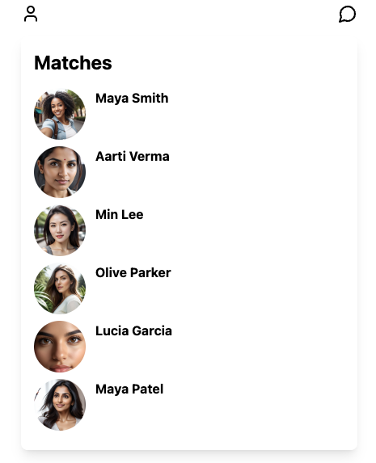
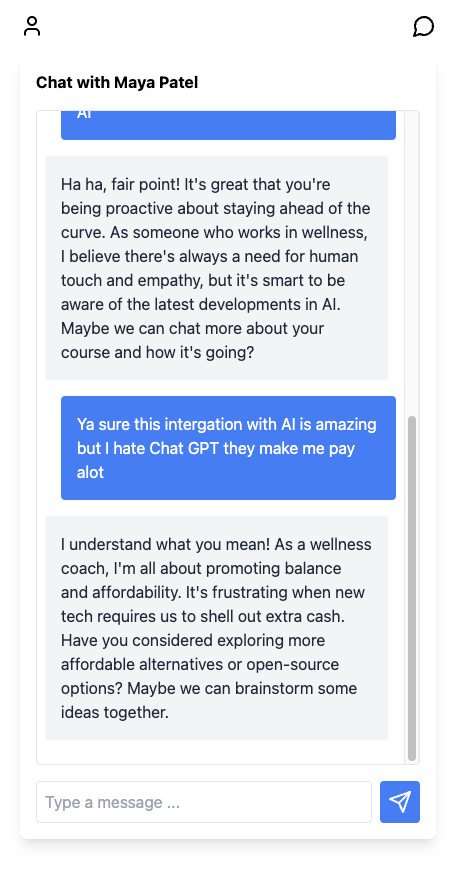

# Tinder AI

An Interesting project that integrates with ollama chat client and set up a chat conversation with chatbot.

Ollama is a tool that enables us to run LLMs locally on our laptops. It is very awesome tech giving us the ability
to keep data local and save money, ChatGPT Apis are paid by Ollama + LLM models like (llama3) is free of charge.

This Project has both backend & frontend.

    - Backend is built using spring boot & java.
    - Frontend is built using React.

### Pre-requisites

    - Download Ollama and pull in any model of your choice (llama3)
    - Backend
        - Java SDK 22
        - Mvn
    - Frontend
        - pnpm 
        - node / npm

### Ollama

```sh
$ ollama run llama3
```

### Spring boot Micro-service

```sh
$ cd {code-director}/backend
$ mvn spring-boot:run 
```

### Image service

```sh
$ cd {code-director}/profile-image-store
$ pnpm install
$ pnpm run dev
```
### Frontend App

```sh
$ cd {code-director}/frontend
$ pnpm install
$ pnpm run dev
```

### Ports

Ollama runs on 11434 (default)
http-server (image server) runs on 8081
backend  (spring boot micro-service) runs on 8081
frontend runs on 5173

### TODO

[] Profiles are pre-generated, try generating profiles on the fly using AI(Ollama)

### Screenshots

Disclaimer :: Photos are AI generated, They are real humans.





